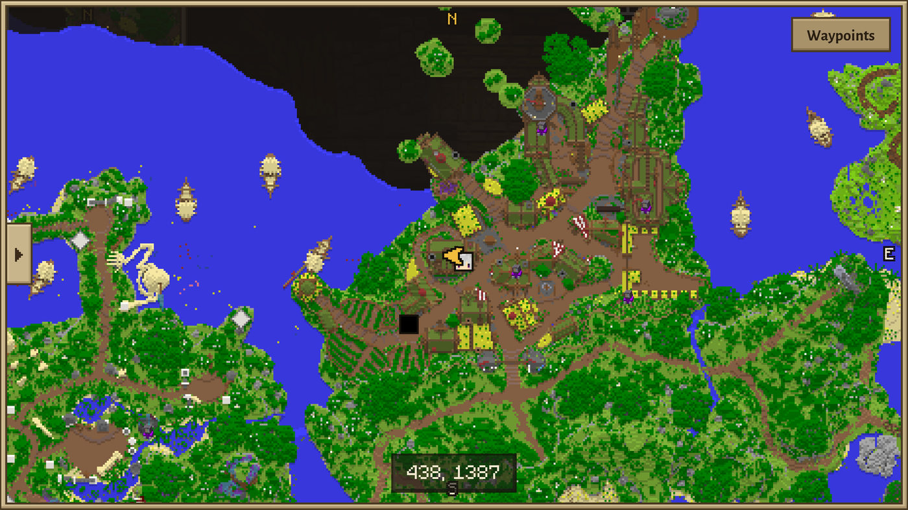
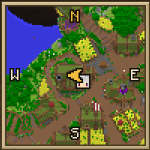
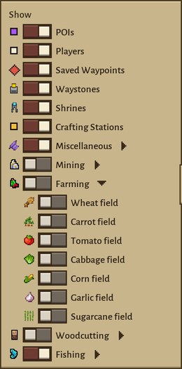
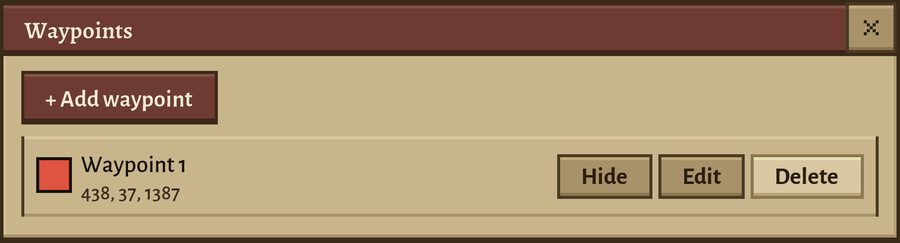
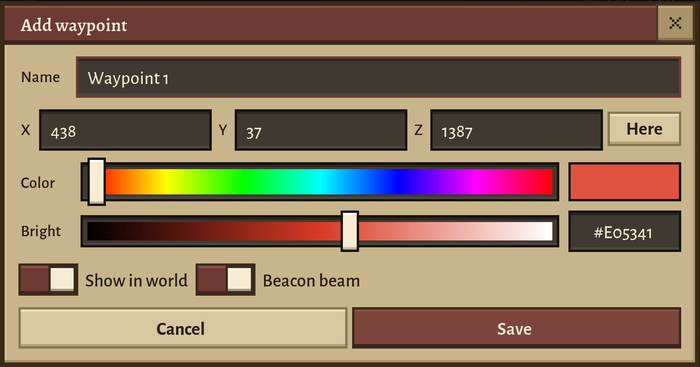

# Isles++

An addon for [Isles+](https://github.com/TMP-devs/IslesPlus). Needs Isles+ 1.0.3 or newer installed next to it.



Started as a few things I wanted in Isles+ and kept growing. What's in it:

- **Map** - minimap + full map on M. Drag to pan, scroll to zoom. It fills in as you walk around, so explore a bit if it looks empty
- Map points: nodes, waystones, shrines, stations, bosses, plushies you haven't found yet, egg nests, other players. Pick what shows in the Show panel on the left of the full map
- **Waypoints**: middle click the map or `/waypoint x z` (or `x y z`, or `clear`). Shows up as a beacon beam with the distance
- Saved waypoints: `/waypoints`, the button on the map, or right click the full map to add one
- `/poi` to add/remove/record your own map points (mostly a dev thing)
- **Health Border** - screen edges glow red as your HP drops
- Item Pickups: shows what you pick up with the icon and amount
- Glow on all ground items

 

 

Settings are in the Isles+ menu (QOL tab). The minimap and Item Pickups can be moved in the HUD editor, keys are under Options > Controls > Isles++.
Everything saves to `config/islesplusplus/`. If you had a map from back when this was part of Isles+ (`config/islesplus/map`) it gets moved over on first start.

## Known issues

- shipped map doesn't cover everything yet

## Versions

Every release has its own branch named `v<mod version>-<Minecraft version>` (`v1.0.0-1.21.11`, `v2.0.0-1.21.11`, ...) holding the code for that version. `main` is always the newest one.

## License

[The Unlicense](LICENSE): public domain, do whatever you want with it. Isles+ itself is not covered by this; it's a separate mod by its own authors.

## Building

Isles+ is All Rights Reserved, so its jar isn't in this repo. Build Isles+ (or download it), put the jar at `libs/islesplus-1.0.3.jar` (or point `islesplus_jar` in `gradle.properties` elsewhere), then run:

```
./gradlew build
```

The jar is in `build/libs/`. `./gradlew runClient` starts a dev client with Isles+ loaded.
